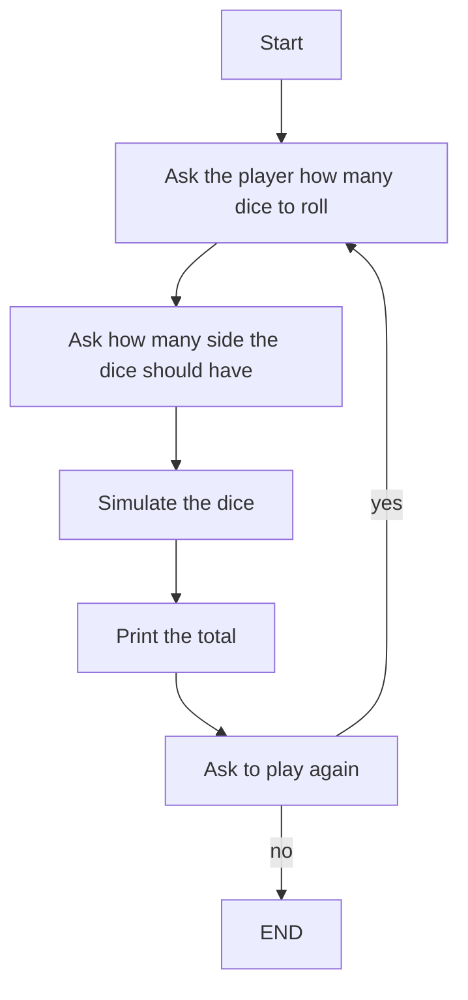
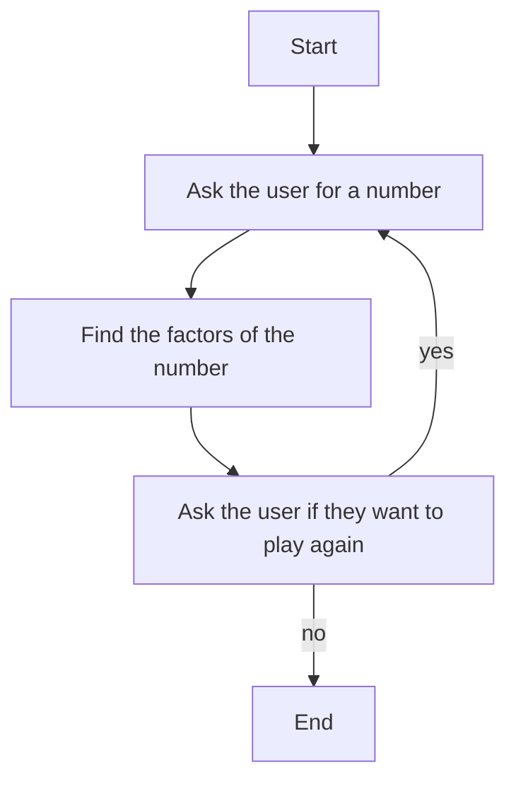
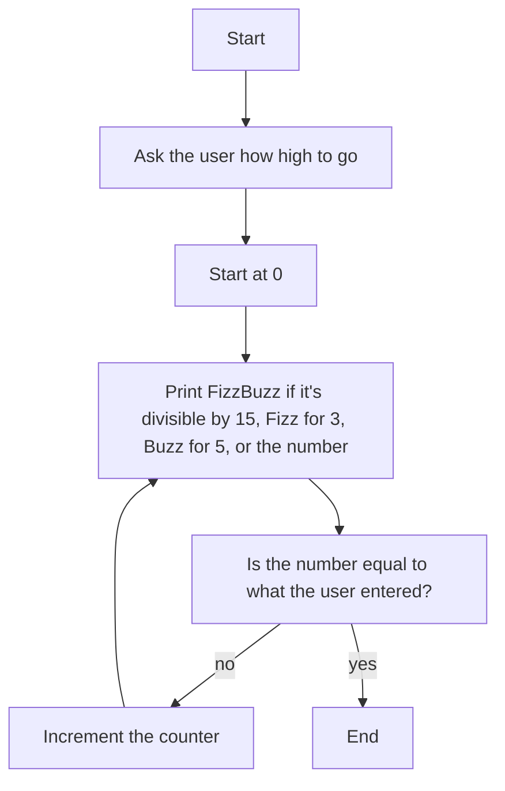
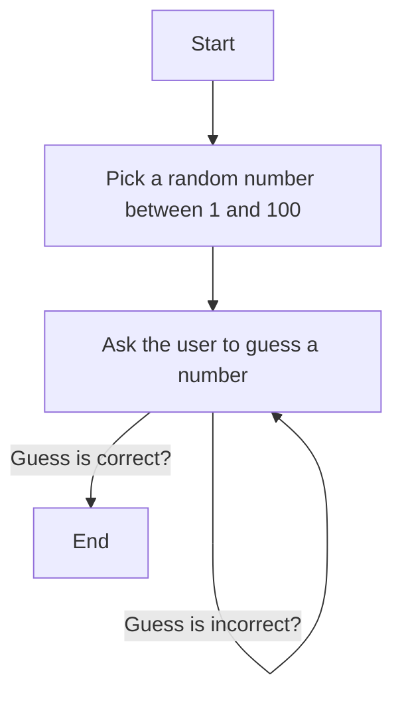
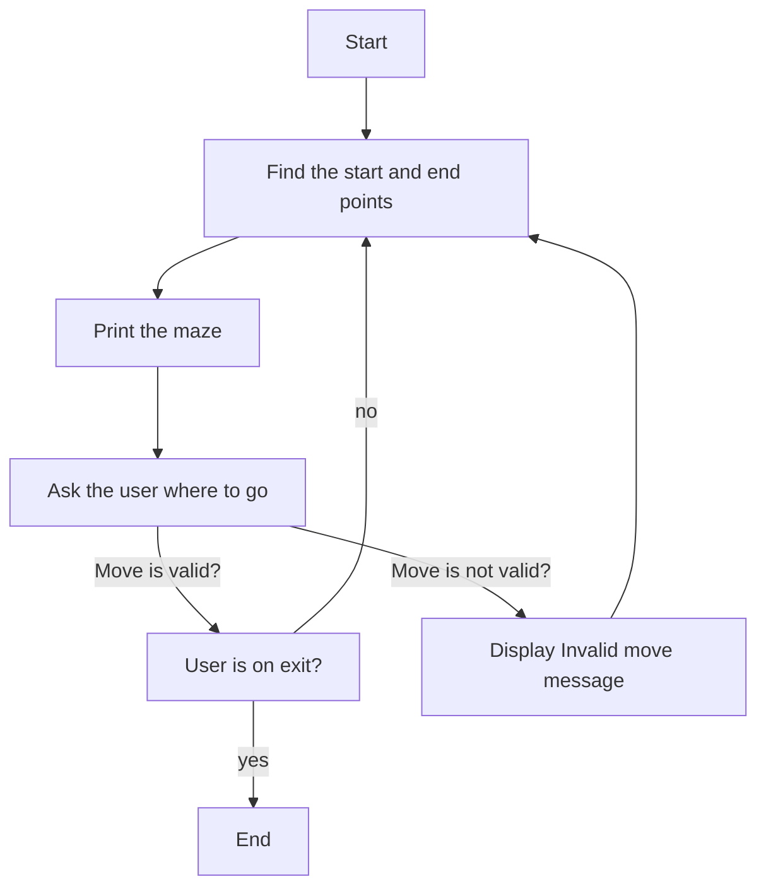

# Flowcharts

These are the flowcharts used to make the games.

###### Dice Roller

```mermaid
flowchart TD
  A[Start] 
  --> B[Ask the player how many dice to roll]
  --> C[Ask how many side the dice should have]
  --> D[Simulate the dice]
  --> E[Print the total]
  --> F[Ask to play again] -- yes --> B
  F -- no --> END
  
```

###### Factor Finder

```mermaid
flowchart TD
  A[Start] 
  --> B[Ask the user for a number]
  --> C[Find the factors of the number]
  --> D[Ask the user if they want to play again] 
  -- yes --> B
  D -- no -->
  E[End]
```

###### Fizz Buzz

```mermaid
flowchart TD
  A[Start]
  --> B[Ask the user how high to go]
  --> C[Start at 0]
  --> D[Print FizzBuzz if it's divisible by 15, Fizz for 3, Buzz for 5, or the number]
  --> E[Is the number equal to what the user entered?] -- no
  --> F[Increment the counter] --> D
  E -- yes --> G[End]
```

###### Guess the Number

```mermaid
flowchart TD
  A[Start]
  --> B[Pick a random number between 1 and 100]
  --> C[Ask the user to guess a number]
  -- Guess is correct? --> G
  C -- Guess is incorrect? --> C
  G[End]
```

###### Maze

```mermaid
flowchart TD
  A[Start]
  --> B[Find the start and end points]
  --> C[Print the maze]
  --> D[Ask the user where to go]
  -- Move is valid? --> E[User is on exit?] -- yes --> F[End]
  E -- no --> B
  D -- Move is not valid? --> G[Display Invalid move message] --> B

```
